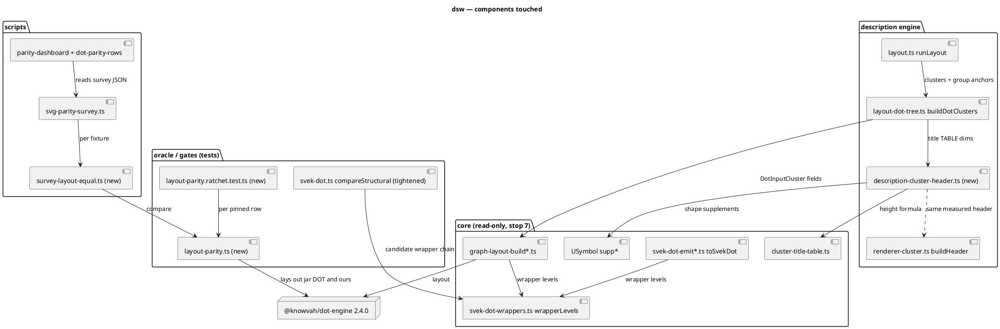

# Component map

Which components dsw touches and how they relate. Core is read-only (stop 7). Rendered with the oracle jar 2026-10-14.

```plantuml
@startuml
title dsw — components touched
package "description engine" {
  [layout.ts runLayout] as RL
  [layout-dot-tree.ts buildDotClusters] as BDC
  [description-cluster-header.ts (new)] as DCH
  [renderer-cluster.ts buildHeader] as BH
}
package "core (read-only, stop 7)" {
  [svek-dot-wrappers.ts wrapperLevels] as WL
  [graph-layout-build*.ts] as GLB
  [svek-dot-emit*.ts toSvekDot] as EMIT
  [cluster-title-table.ts] as CTT
  [USymbol supp*] as US
}
package "oracle / gates (tests)" {
  [svek-dot.ts compareStructural (tightened)] as CS
  [layout-parity.ts (new)] as LP
  [layout-parity.ratchet.test.ts (new)] as LPR
}
package "scripts" {
  [svg-parity-survey.ts] as SV
  [survey-layout-equal.ts (new)] as SLE
  [parity-dashboard + dot-parity-rows] as DASH
}
node "@knowvah/dot-engine 2.4.0" as DE
RL --> BDC : clusters + group anchors
BDC --> DCH : title TABLE dims
DCH --> CTT : height formula
DCH --> US : shape supplements
DCH ..> BH : same measured header
BDC --> GLB : DotInputCluster fields
GLB --> WL : wrapper levels
EMIT --> WL : wrapper levels
GLB --> DE : layout
CS --> WL : candidate wrapper chain
LP --> DE : lays out jar DOT and ours
LPR --> LP : per pinned row
SV --> SLE : per fixture
SLE --> LP : compare
DASH --> SV : reads survey JSON
@enduml
```
