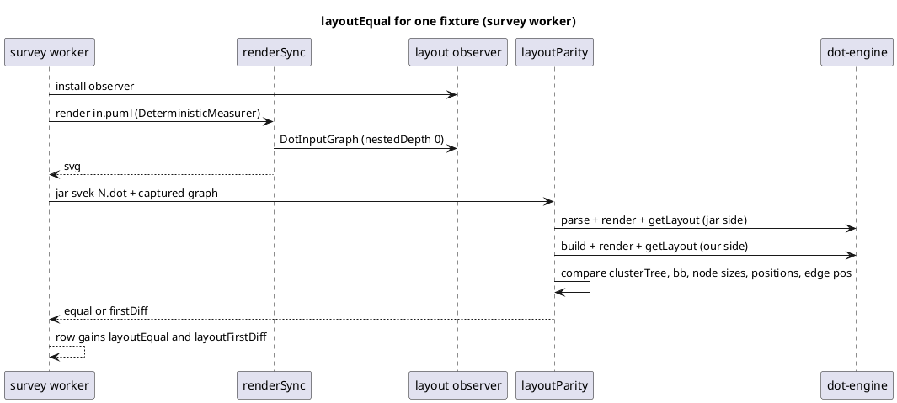

# Data flow

How one survey row gets `layoutEqual` (T2), using T1a's `layoutParity`. The ratchet test (D3) runs the same flow per pinned row. Rendered with the oracle jar 2026-10-14.

```plantuml
@startuml
title layoutEqual for one fixture (survey worker)
participant "survey worker" as W
participant "renderSync" as R
participant "layout observer" as O
participant "layoutParity" as LP
participant "dot-engine" as DE
W -> O : install observer
W -> R : render in.puml (DeterministicMeasurer)
R -> O : DotInputGraph (nestedDepth 0)
R --> W : svg
W -> LP : jar svek-N.dot + captured graph
LP -> DE : parse + render + getLayout (jar side)
LP -> DE : build + render + getLayout (our side)
LP -> LP : compare clusterTree, bb, node sizes, positions, edge pos
LP --> W : equal or firstDiff
W --> W : row gains layoutEqual and layoutFirstDiff
@enduml
```
