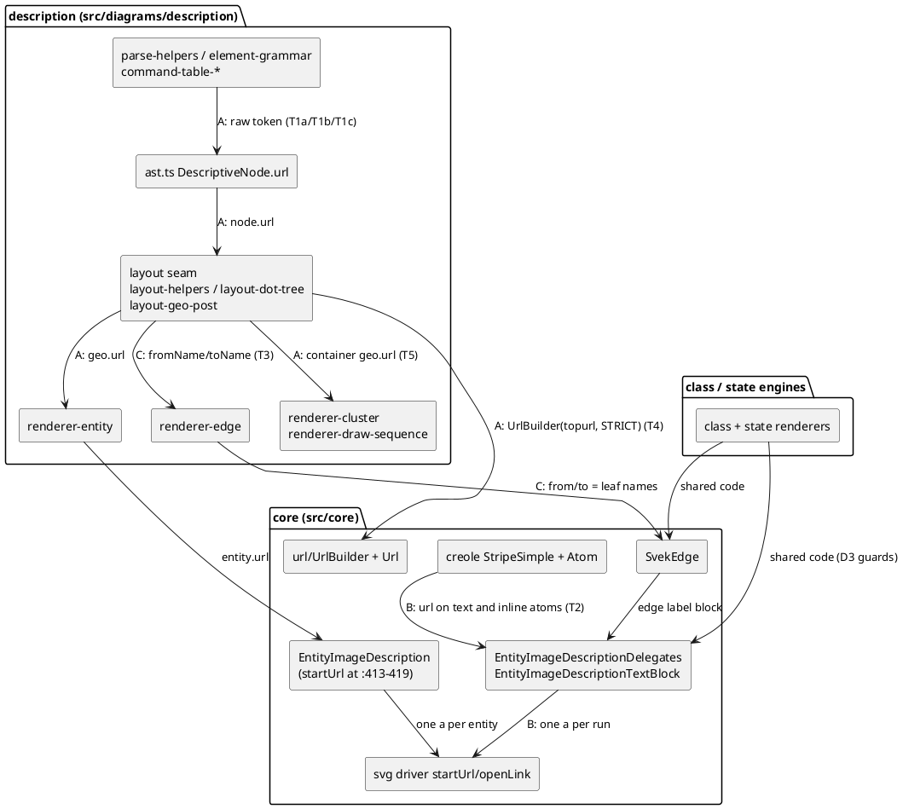

# Component map — what dur touches

```plantuml
@startuml
skinparam componentStyle rectangle
package "description (src/diagrams/description)" {
  [parse-helpers / element-grammar\ncommand-table-*] as Parse
  [ast.ts DescriptiveNode.url] as Ast
  [layout seam\nlayout-helpers / layout-dot-tree\nlayout-geo-post] as Layout
  [renderer-entity] as REntity
  [renderer-cluster\nrenderer-draw-sequence] as RCluster
  [renderer-edge] as REdge
}
package "core (src/core)" {
  [url/UrlBuilder + Url] as UrlB
  [creole StripeSimple + Atom] as Creole
  [EntityImageDescription\n(startUrl at :413-419)] as EID
  [EntityImageDescriptionDelegates\nEntityImageDescriptionTextBlock] as Drawers
  [SvekEdge] as Svek
  [svg driver startUrl/openLink] as Svg
}
package "class / state engines" {
  [class + state renderers] as Others
}
Parse --> Ast : A: raw token (T1a/T1b/T1c)
Ast --> Layout : A: node.url
Layout --> UrlB : A: UrlBuilder(topurl, STRICT) (T4)
Layout --> REntity : A: geo.url
Layout --> RCluster : A: container geo.url (T5)
Layout --> REdge : C: fromName/toName (T3)
REntity --> EID : entity.url
EID --> Svg : one a per entity
Creole --> Drawers : B: url on text and inline atoms (T2)
Drawers --> Svg : B: one a per run
REdge --> Svek : C: from/to = leaf names
Svek --> Drawers : edge label block
Others --> Drawers : shared code (D3 guards)
Others --> Svek : shared code
@enduml
```
