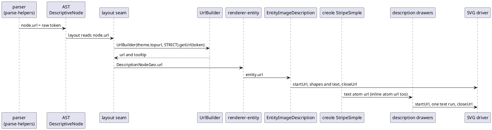

# Data flow — an entity URL and an inline URL

```plantuml
@startuml
participant "parser\n(parse-helpers)" as P
participant "AST\nDescriptiveNode" as A
participant "layout seam" as L
participant "UrlBuilder" as U
participant "renderer-entity" as R
participant "EntityImageDescription" as E
participant "creole StripeSimple" as C
participant "description drawers" as D
participant "SVG driver" as S

P -> A : node.url = raw token
A -> L : layout reads node.url
L -> U : UrlBuilder(theme.topurl, STRICT).getUrl(token)
U --> L : url and tooltip
L -> R : DescriptionNodeGeo.url
R -> E : entity.url
E -> S : startUrl, shapes and text, closeUrl
C -> D : text atom url (inline atom url too)
D -> S : startUrl, one text run, closeUrl
@enduml
```
