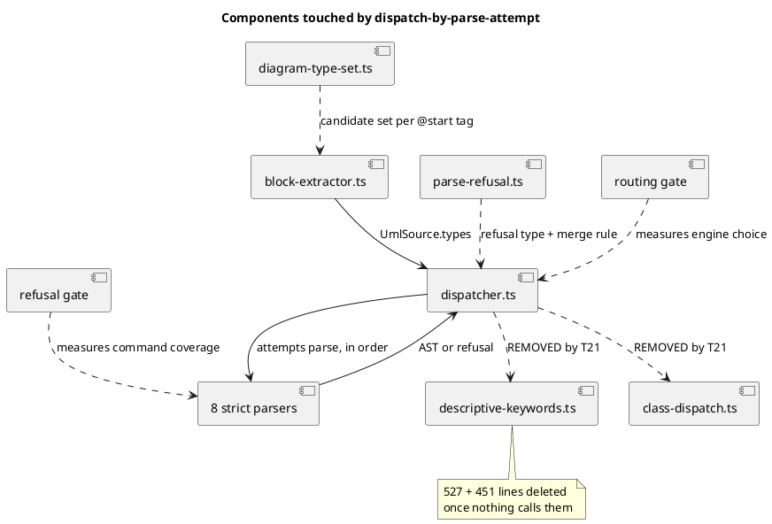

# Component map — what this mission touches

`json`, `yaml`, `hcl` and `files` are deliberately absent: their upstream
factories extend `PSystemAbstractFactory` and keep their own document-parser
error semantics ([D6](../decisions.md#d6)). `dot` is passthrough.
