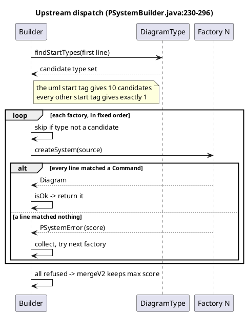
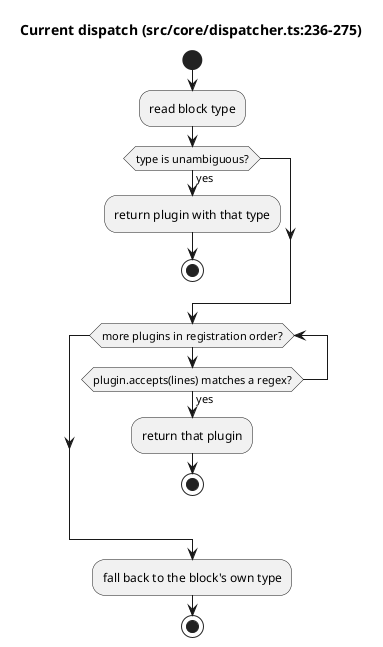
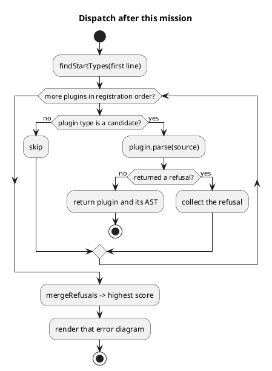

# Dispatch flow — upstream, ours today, ours after

## Upstream — `PSystemBuilder.createPSystem`

Sequence, because *who* is asked and *in what order* is the whole mechanism.

## Ours today

The parser is never consulted, so a plugin can claim a source it cannot parse.
That is the divergence: `sequencePlugin.accepts()` is true for 1343 of 3158
fixtures, 244 of which are not sequence diagrams.

## Ours after

The AST returns with the plugin so `renderSync` reuses resolution's parse
rather than repeating it ([D0](../decisions.md#d0), T12 criterion 4).
