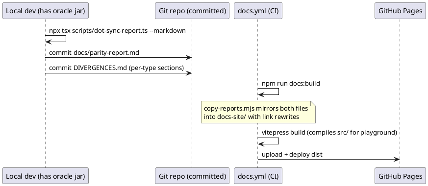
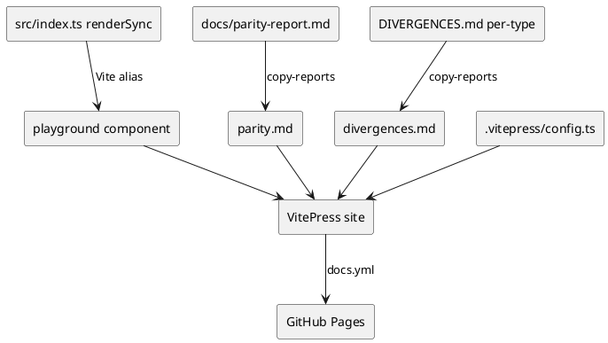

# Report pipeline data flow

```plantuml
@startuml
participant "Local dev (has oracle jar)" as Dev
participant "Git repo (committed)" as Repo
participant "docs.yml (CI)" as CI
participant "GitHub Pages" as Pages
Dev -> Dev : npx tsx scripts/dot-sync-report.ts --markdown
Dev -> Repo : commit docs/parity-report.md
Dev -> Repo : commit DIVERGENCES.md (per-type sections)
CI -> CI : npm run docs:build
note over CI : copy-reports.mjs mirrors both files\ninto docs-site/ with link rewrites
CI -> CI : vitepress build (compiles src/ for playground)
CI -> Pages : upload + deploy dist
@enduml
```

```plantuml
@startuml
skinparam componentStyle rectangle
skinparam shadowing false

[src/index.ts renderSync] as src
[playground component] as PG
[docs/parity-report.md] as PR
[parity.md] as P
[DIVERGENCES.md per-type] as DV
[divergences.md] as D
[.vitepress/config.ts] as CFG
[VitePress site] as Site
[GitHub Pages] as GH

src --> PG : Vite alias
PR --> P : copy-reports
DV --> D : copy-reports
CFG --> Site
PG --> Site
P --> Site
D --> Site
Site --> GH : docs.yml
@enduml
```
