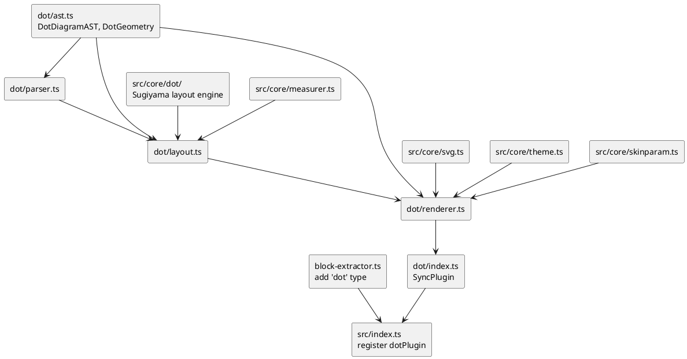

# Component Map

```plantuml
@startuml
skinparam componentStyle rectangle
skinparam shadowing false

[block-extractor.ts\nadd 'dot' type] as BE
[src/index.ts\nregister dotPlugin] as IDX
[dot/ast.ts\nDotDiagramAST, DotGeometry] as AST
[dot/parser.ts] as PAR
[dot/layout.ts] as LAY
[dot/renderer.ts] as REN
[dot/index.ts\nSyncPlugin] as PLUG
[src/core/dot/\nSugiyama layout engine] as CORE_DOT
[src/core/svg.ts] as SVG
[src/core/theme.ts] as THEME
[src/core/measurer.ts] as MEAS
[src/core/skinparam.ts] as SKIN

BE --> IDX
AST --> PAR
AST --> LAY
AST --> REN
PAR --> LAY
LAY --> REN
REN --> PLUG
PLUG --> IDX
CORE_DOT --> LAY
SVG --> REN
THEME --> REN
MEAS --> LAY
SKIN --> REN
@enduml
```
