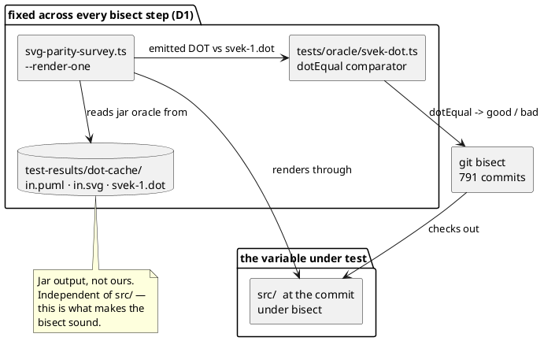

# Component map — what the bisect touches

The predicate holds everything fixed except `src/`, so the only variable
across bisect steps is the port itself.

```plantuml
@startuml
skinparam componentStyle rectangle

package "fixed across every bisect step (D1)" {
  component [svg-parity-survey.ts\n--render-one] as PRED
  component [tests/oracle/svek-dot.ts\ndotEqual comparator] as CMP
  database "test-results/dot-cache/\nin.puml · in.svg · svek-1.dot" as CACHE
}

package "the variable under test" {
  component [src/  at the commit\nunder bisect] as SRC
}

component [git bisect\n791 commits] as BISECT

BISECT -down-> SRC : checks out
PRED -right-> SRC : renders through
PRED -down-> CACHE : reads jar oracle from
PRED -right-> CMP : emitted DOT vs svek-1.dot
CMP -down-> BISECT : dotEqual -> good / bad

note bottom of CACHE
  Jar output, not ours.
  Independent of src/ —
  this is what makes the
  bisect sound.
end note
@enduml
```
