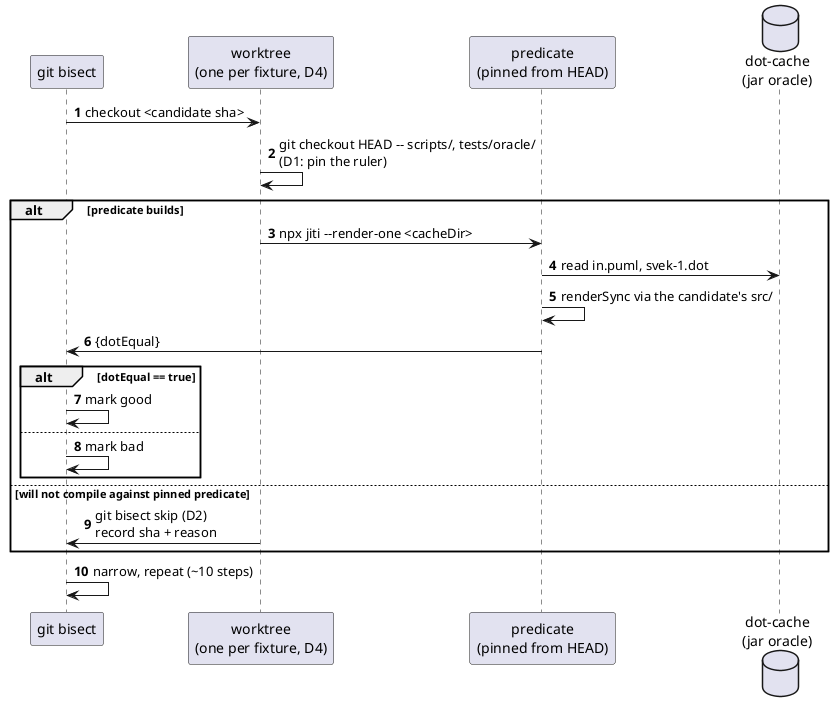

# Data flow — one bisect step

The `skip` branch is why a bisect may end on a **span** rather than a single
commit. A span is still actionable, but stop condition 4 still applies: the
artifact must name a mechanism either way.
