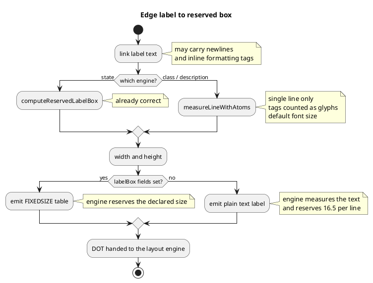

# How an edge label becomes a reserved box

Both batches 1 and 2 sit on this path. Batch 1 fixes what the measurement
produces; batch 2 fixes how it reaches the engine.

Colour and formatting tags are described in prose below rather than written
literally, because a creole tag inside a diagram is parsed as markup.

**Batch 1** removes the left-hand branch: class and description join state on
`computeReservedLabelBox`, with markup stripped and the arrow font size
honoured.

**Batch 2** removes the lower branch: every engine populates the box fields, so
the engine reserves the declared size instead of measuring text.
