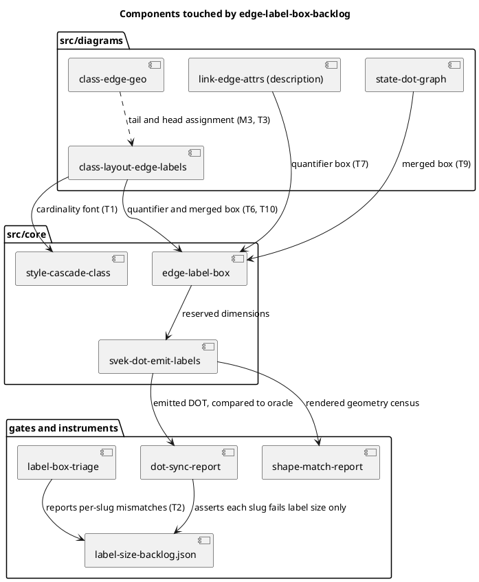

# Component map — what this mission touches

Solid arrows are call edges after the mission; the dotted one is M3's suspected
origin, unconfirmed until T3 reports.

## Ownership, one writer per file

| Component | Owned by |
|---|---|
| `edge-label-box` | T5, then T8 — never concurrently |
| `style-cascade-class` | T1 |
| `class-layout-edge-labels` | T6, then T10 |
| `link-edge-attrs` | T7 |
| `state-dot-graph`, `state-composite-edge-label` | T9 |
| `class-edge-geo` | T11, only if T3 confirms it |
| class + object backlogs | T6, then T10 |
| description backlog | T7 |
| state backlog | T9 |

`edge-label-box` is the only file two tasks both need, which is why Batches 2
and 4 each hold a single task. Everything else is disjoint within its batch.
