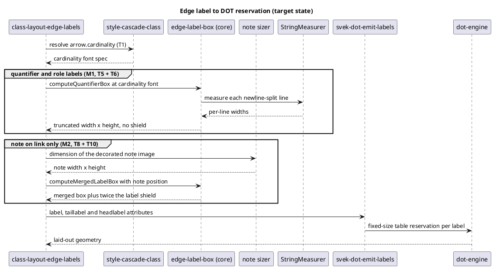

# Data flow — how an edge label becomes a reserved box

The target state, after all seven batches. Today the class engine skips the
cardinality cascade and the note sizer entirely, and computes its own box
instead of calling the shared module — that divergence is M1 and M2.

**Why the two groups differ.** The label arm adds `2 * labelShield` and
`2 * marginLabel`; the quantifier arm adds neither and takes the raw measured
dimension (`SvekEdge.java:440-445` against `:447-467`). That asymmetry is the
reason `computeQuantifierBox` exists as a separate function rather than a flag
on the existing one.

**Where the gate sits.** `svek-dot-emit-labels` writes the reservation, and
SI22's D7 comparator reads it back out of both our DOT and the oracle's. Before
D7 the comparator checked only that a label existed — which is how a 336-wide
box scored equal to a 72-wide one, and why the backlog exists at all.
