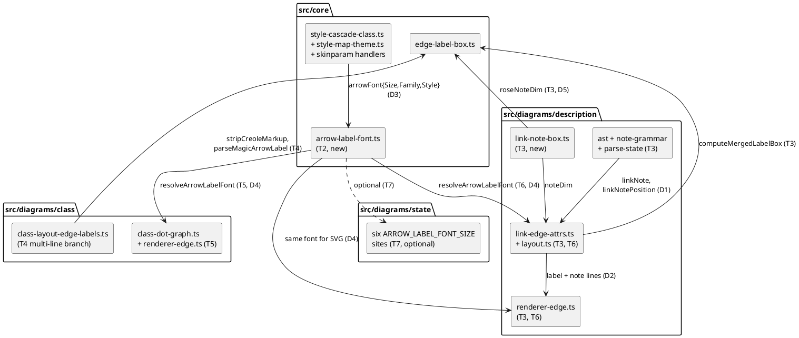

# Component map — what this mission touches

Shared arithmetic in `src/core/`, one wiring per engine. Solid arrows are the
new or changed dependencies; the state arm (T7) is optional.

`computeQuantifierBox` (T1) changes inside `edge-label-box.ts` and is already
consumed by both class and description — no new edge.
