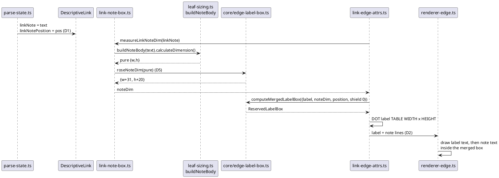

# Data flow — how a description `note on link` becomes a reserved box (T3)

Before: the parser folds the note text into `link.label`; the DOT box is a
bare label. After: `linkNote` rides the AST, the note operand is sized as a
`ComponentRoseNote`, and the merge arithmetic SI23 ported produces the box.

The arrow-font path (T2 → T5/T6) is a one-hop resolver, not a flow:
`resolveArrowLabelFont(theme)` is called once per layout and once per render.
