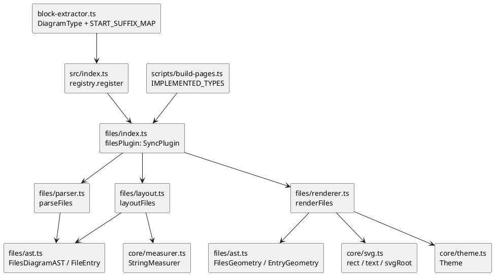

# Component Map — Files Diagram

```plantuml
@startuml
skinparam componentStyle rectangle
skinparam shadowing false

[block-extractor.ts\nDiagramType + START_SUFFIX_MAP] as BE
[src/index.ts\nregistry.register] as IDX
[files/index.ts\nfilesPlugin: SyncPlugin] as PLUG
[files/parser.ts\nparseFiles] as PARSE
[files/layout.ts\nlayoutFiles] as LAY
[files/renderer.ts\nrenderFiles] as REND
[files/ast.ts\nFilesDiagramAST / FileEntry] as AST
[core/measurer.ts\nStringMeasurer] as MEAS
[files/ast.ts\nFilesGeometry / EntryGeometry] as GEO
[core/svg.ts\nrect / text / svgRoot] as SVG
[core/theme.ts\nTheme] as THEME
[scripts/build-pages.ts\nIMPLEMENTED_TYPES] as BP

BE --> IDX
IDX --> PLUG
PLUG --> PARSE
PLUG --> LAY
PLUG --> REND
PARSE --> AST
LAY --> AST
LAY --> MEAS
REND --> GEO
REND --> SVG
REND --> THEME
BP --> PLUG
@enduml
```
