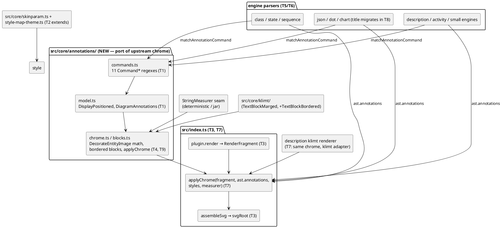

# G0b component map

Upstream mirror: `TitledDiagram` fields → `DiagramAnnotations`;
`CommonCommands.addTitleCommands` → `commands.ts`; `DiagramChromeFactory` +
`DecorateEntityImage` + `EntityImageLegend` → `chrome.ts`/`blocks.ts`;
`UgDiagram.getExporter` (getTextBlock → addChrome → exporter) →
`plugin.render → applyChrome → assembleSvg`.
