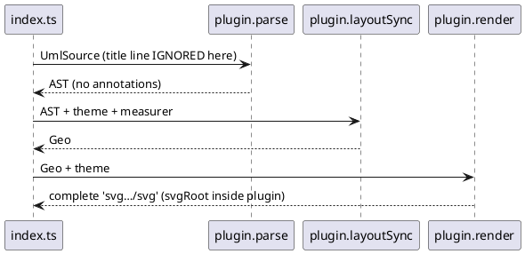
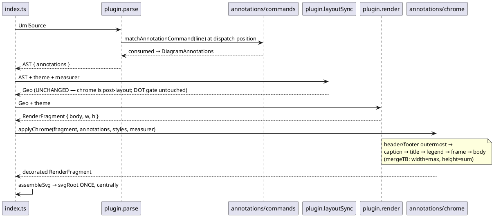

# G0b data flow — render pipeline before / after

## Before (today)

## After (G0b)

Chrome wrap order (DiagramChromeFactory.create :137-149, applied inside-out):
frame → legend → title → caption → header/footer.
