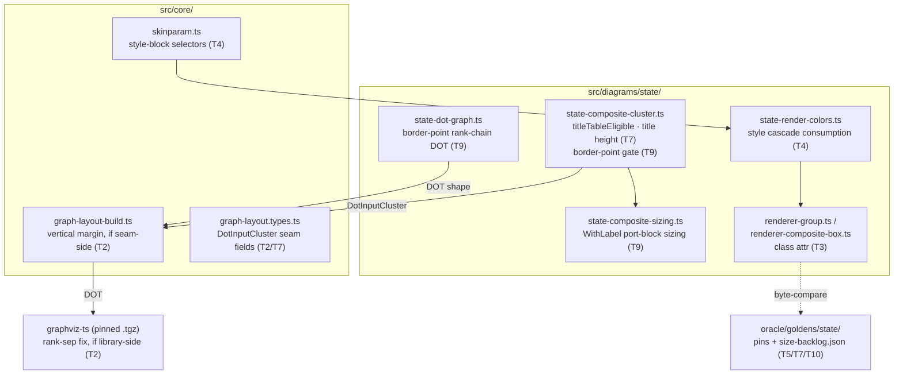

# Component map — what G6 touches

Read-only references: `~/git/plantuml` (svek Cluster/ClusterHeader,
EntityImageStateBorder, net/atmp), `~/git/graphviz/lib/dotgen/
position.c` (cluster rank-sep).
