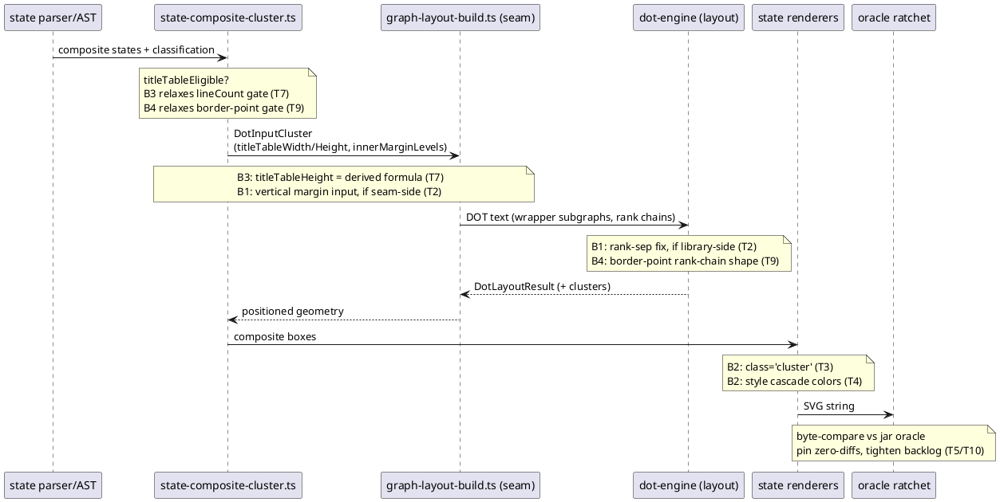

# Data flow — cluster geometry pipeline and where each batch acts

```plantuml
@startuml
participant "state parser/AST" as P
participant "state-composite-cluster.ts" as C
participant "graph-layout-build.ts (seam)" as B
participant "dot-engine (layout)" as G
participant "state renderers" as R
participant "oracle ratchet" as O
P -> C : composite states + classification
note over C : titleTableEligible?\nB3 relaxes lineCount gate (T7)\nB4 relaxes border-point gate (T9)
C -> B : DotInputCluster\n(titleTableWidth/Height, innerMarginLevels)
note over C,B : B3: titleTableHeight = derived formula (T7)\nB1: vertical margin input, if seam-side (T2)
B -> G : DOT text (wrapper subgraphs, rank chains)
note over G : B1: rank-sep fix, if library-side (T2)\nB4: border-point rank-chain shape (T9)
G --> B : DotLayoutResult (+ clusters)
B --> C : positioned geometry
C -> R : composite boxes
note over R : B2: class='cluster' (T3)\nB2: style cascade colors (T4)
R -> O : SVG string
note over O : byte-compare vs jar oracle\npin zero-diffs, tighten backlog (T5/T10)
@enduml
```
