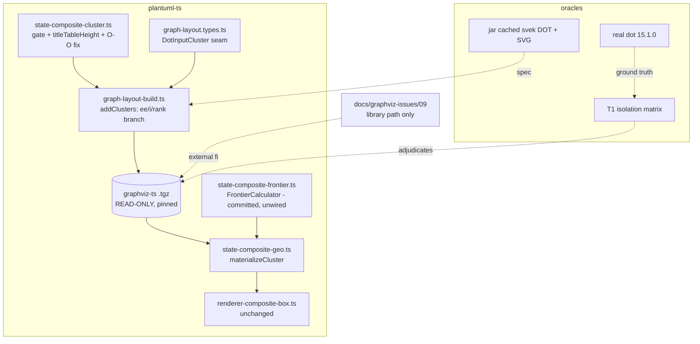

# G7 component map

```mermaid
graph TD
  subgraph plantuml-ts
    SCC[state-composite-cluster.ts<br/>gate + titleTableHeight + O-O fix] --> GLB[graph-layout-build.ts<br/>addClusters: ee/i/rank branch]
    GLT[graph-layout.types.ts<br/>DotInputCluster seam] --> GLB
    GLB --> GVTS[(graphviz-ts .tgz<br/>READ-ONLY, pinned)]
    GVTS --> GEO[state-composite-geo.ts<br/>materializeCluster]
    FC[state-composite-frontier.ts<br/>FrontierCalculator - committed, unwired] --> GEO
    GEO --> REN[renderer-composite-box.ts<br/>unchanged]
  end
  subgraph oracles
    JAR[jar cached svek DOT + SVG] -.spec.-> GLB
    DOT[real dot 15.1.0] -.ground truth.-> M[T1 isolation matrix]
  end
  M -.adjudicates.-> GVTS
  ISS9[docs/graphviz-issues/09<br/>library path only] -.external fix.-> GVTS
```
