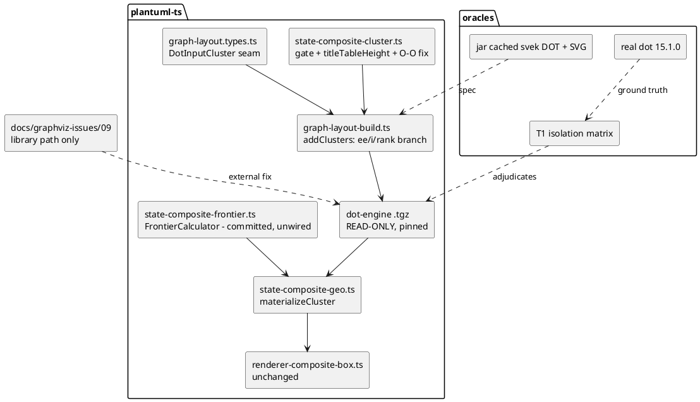

# G7 component map

```plantuml
@startuml
skinparam componentStyle rectangle
skinparam shadowing false

package "plantuml-ts" {
  [state-composite-cluster.ts\ngate + titleTableHeight + O-O fix] as SCC
  [graph-layout-build.ts\naddClusters: ee/i/rank branch] as GLB
  [graph-layout.types.ts\nDotInputCluster seam] as GLT
  [dot-engine .tgz\nREAD-ONLY, pinned] as GVTS
  [state-composite-geo.ts\nmaterializeCluster] as GEO
  [state-composite-frontier.ts\nFrontierCalculator - committed, unwired] as FC
  [renderer-composite-box.ts\nunchanged] as REN
}

package "oracles" {
  [jar cached svek DOT + SVG] as JAR
  [real dot 15.1.0] as DOT
  [T1 isolation matrix] as M
}

[docs/graphviz-issues/09\nlibrary path only] as ISS9

SCC --> GLB
GLT --> GLB
GLB --> GVTS
GVTS --> GEO
FC --> GEO
GEO --> REN
JAR ..> GLB : spec
DOT ..> M : ground truth
M ..> GVTS : adjudicates
ISS9 ..> GVTS : external fix
@enduml
```
