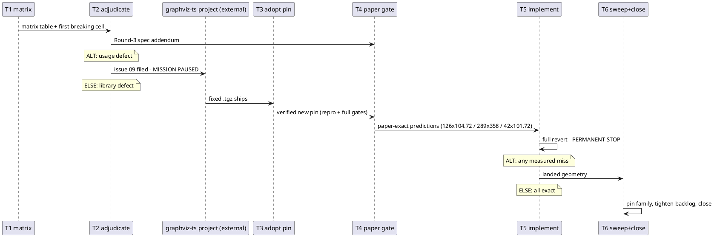

# G7 mission flow

```plantuml
@startuml
' NOTE: mermaid grouping flattened -- alt/opt/loop/group render the whole
' diagram EMPTY in plantuml-ts today (.agent-notes/plantuml-sequence-group-empty.md).
' Original nesting: alt usage defect ; else library defect ; alt any measured miss ; else all exact
participant "T1 matrix" as T1
participant "T2 adjudicate" as T2
participant "graphviz-ts project (external)" as EXT
participant "T3 adopt pin" as T3
participant "T4 paper gate" as T4
participant "T5 implement" as T5
participant "T6 sweep+close" as T6
T1 -> T2 : matrix table + first-breaking cell
T2 -> T4 : Round-3 spec addendum
note over T2 : ALT: usage defect
T2 -> EXT : issue 09 filed - MISSION PAUSED
note over T2 : ELSE: library defect
EXT -> T3 : fixed .tgz ships
T3 -> T4 : verified new pin (repro + full gates)
T4 -> T5 : paper-exact predictions (126x104.72 / 289x358 / 42x101.72)
T5 -> T5 : full revert - PERMANENT STOP
note over T5 : ALT: any measured miss
T5 -> T6 : landed geometry
note over T5 : ELSE: all exact
T6 -> T6 : pin family, tighten backlog, close
@enduml
```
