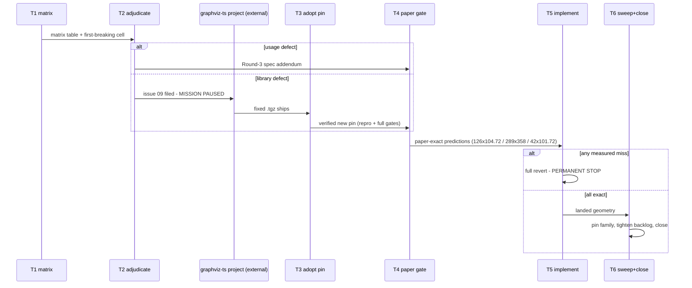

# G7 mission flow

```mermaid
sequenceDiagram
  participant T1 as T1 matrix
  participant T2 as T2 adjudicate
  participant EXT as graphviz-ts project (external)
  participant T3 as T3 adopt pin
  participant T4 as T4 paper gate
  participant T5 as T5 implement
  participant T6 as T6 sweep+close
  T1->>T2: matrix table + first-breaking cell
  alt usage defect
    T2->>T4: Round-3 spec addendum
  else library defect
    T2->>EXT: issue 09 filed - MISSION PAUSED
    EXT->>T3: fixed .tgz ships
    T3->>T4: verified new pin (repro + full gates)
  end
  T4->>T5: paper-exact predictions (126x104.72 / 289x358 / 42x101.72)
  alt any measured miss
    T5->>T5: full revert - PERMANENT STOP
  else all exact
    T5->>T6: landed geometry
    T6->>T6: pin family, tighten backlog, close
  end
```
