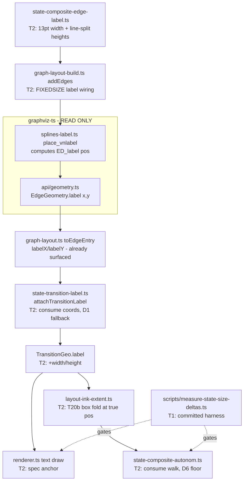

# G8 component map

```mermaid
graph TD
  subgraph graphviz-ts [graphviz-ts - READ ONLY]
    VN[splines-label.ts place_vnlabel<br/>computes ED_label pos] --> GEO[api/geometry.ts<br/>EdgeGeometry.label x,y]
  end
  GEO --> TEE[graph-layout.ts toEdgeEntry<br/>labelX/labelY - already surfaced]
  ADD[graph-layout-build.ts addEdges<br/>T2: FIXEDSIZE label wiring] --> VN
  MEAS[state-composite-edge-label.ts<br/>T2: 13pt width + line-split heights] --> ADD
  TEE --> ATL[state-transition-label.ts<br/>attachTransitionLabel<br/>T2: consume coords, D1 fallback]
  ATL --> TG[TransitionGeo.label<br/>T2: +width/height]
  TG --> REN[renderer.ts text draw<br/>T2: spec anchor]
  TG --> INK[layout-ink-extent.ts<br/>T2: T20b box fold at true pos]
  INK --> AUT[state-composite-autonom.ts<br/>T2: consume walk, D6 floor]
  HARN[scripts/measure-state-size-deltas.ts<br/>T1: committed harness] -.gates.-> AUT
  HARN -.gates.-> REN
```
