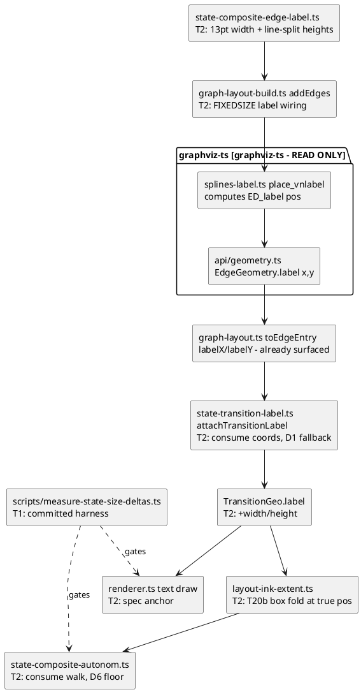

# G8 component map

```plantuml
@startuml
skinparam componentStyle rectangle
skinparam shadowing false

package "graphviz-ts [graphviz-ts - READ ONLY]" {
  [splines-label.ts place_vnlabel\ncomputes ED_label pos] as VN
  [api/geometry.ts\nEdgeGeometry.label x,y] as GEO
}

[graph-layout.ts toEdgeEntry\nlabelX/labelY - already surfaced] as TEE
[graph-layout-build.ts addEdges\nT2: FIXEDSIZE label wiring] as ADD
[state-composite-edge-label.ts\nT2: 13pt width + line-split heights] as MEAS
[state-transition-label.ts\nattachTransitionLabel\nT2: consume coords, D1 fallback] as ATL
[TransitionGeo.label\nT2: +width/height] as TG
[renderer.ts text draw\nT2: spec anchor] as REN
[layout-ink-extent.ts\nT2: T20b box fold at true pos] as INK
[state-composite-autonom.ts\nT2: consume walk, D6 floor] as AUT
[scripts/measure-state-size-deltas.ts\nT1: committed harness] as HARN

VN --> GEO
GEO --> TEE
ADD --> VN
MEAS --> ADD
TEE --> ATL
ATL --> TG
TG --> REN
TG --> INK
INK --> AUT
HARN ..> AUT : gates
HARN ..> REN : gates
@enduml
```
