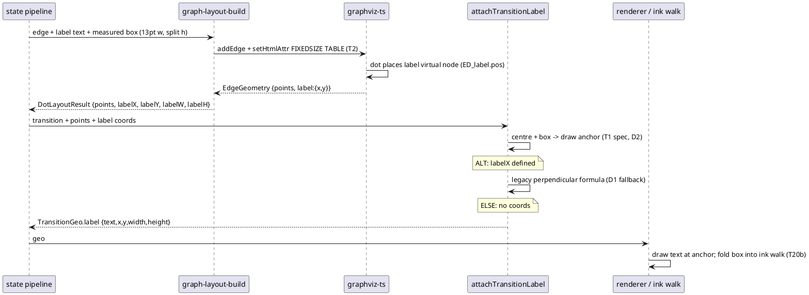

# G8 data flow — labeled transition

```plantuml
@startuml
' NOTE: mermaid grouping flattened -- alt/opt/loop/group render the whole
' diagram EMPTY in plantuml-ts today (.agent-notes/plantuml-sequence-group-empty.md).
' Original nesting: alt labelX defined ; else no coords
participant "state pipeline" as P
participant "graph-layout-build" as B
participant "graphviz-ts" as G
participant "attachTransitionLabel" as A
participant "renderer / ink walk" as R
P -> B : edge + label text + measured box (13pt w, split h)
B -> G : addEdge + setHtmlAttr FIXEDSIZE TABLE (T2)
G -> G : dot places label virtual node (ED_label.pos)
G --> B : EdgeGeometry {points, label:{x,y}}
B --> P : DotLayoutResult {points, labelX, labelY, labelW, labelH}
P -> A : transition + points + label coords
A -> A : centre + box -> draw anchor (T1 spec, D2)
note over A : ALT: labelX defined
A -> A : legacy perpendicular formula (D1 fallback)
note over A : ELSE: no coords
A --> P : TransitionGeo.label {text,x,y,width,height}
P -> R : geo
R -> R : draw text at anchor; fold box into ink walk (T20b)
@enduml
```
