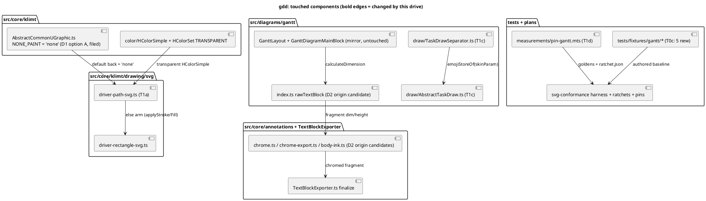

# Component map — what gdd touches

```plantuml
@startuml
title gdd: touched components (bold edges = changed by this drive)
package "src/core/klimt/drawing/svg" {
  [driver-path-svg.ts (T1a)] as Path
  [driver-rectangle-svg.ts] as Rect
}
package "src/core/klimt" {
  [AbstractCommonUGraphic.ts\nNONE_PAINT = 'none' (D1 option A, filed)] as UG
  [color/HColorSimple + HColorSet TRANSPARENT] as Col
}
package "src/core/annotations + TextBlockExporter" {
  [chrome.ts / chrome-export.ts / body-ink.ts (D2 origin candidates)] as Chrome
  [TextBlockExporter.ts finalize] as Fin
}
package "src/diagrams/gantt" {
  [index.ts rawTextBlock (D2 origin candidate)] as GIdx
  [draw/TaskDrawSeparator.ts (T1c)] as Sep
  [draw/AbstractTaskDraw.ts (T1c)] as ATD
  [GanttLayout + GanttDiagramMainBlock (mirror, untouched)] as Lay
}
package "tests + plans" {
  [tests/fixtures/gantt/* (T0c: 5 new)] as Fx
  [svg-conformance harness + ratchets + pins] as Harness
  [measurements/pin-gantt.mts (T1d)] as Pin
}
UG --> Path : default back = 'none'
Col --> Path : transparent HColorSimple
Path --> Rect : else arm (applyStroke/Fill)
GIdx --> Chrome : fragment dim/height
Chrome --> Fin : chromed fragment
Lay --> GIdx : calculateDimension
Sep --> ATD : emojiStoreOf(skinParam)
Fx --> Harness : authored baseline
Pin --> Harness : goldens + ratchet.json
@enduml
```
