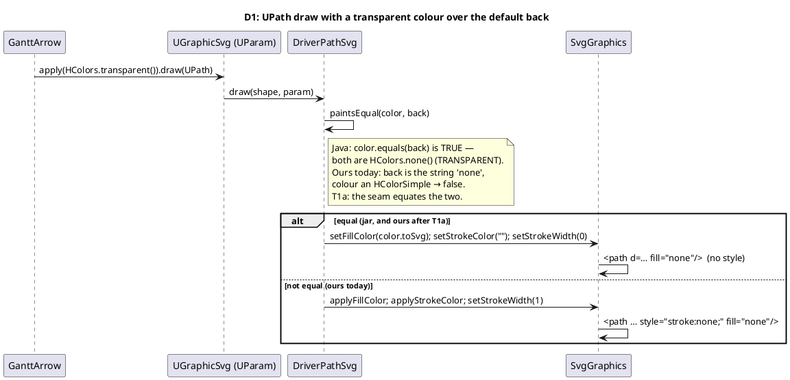
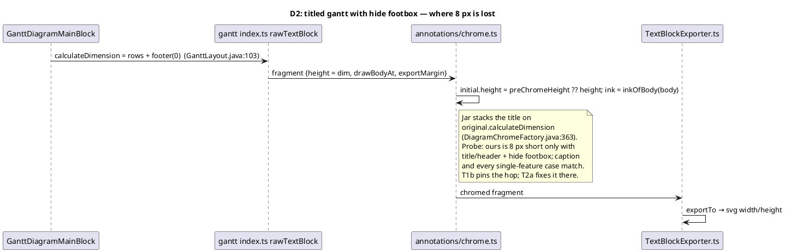
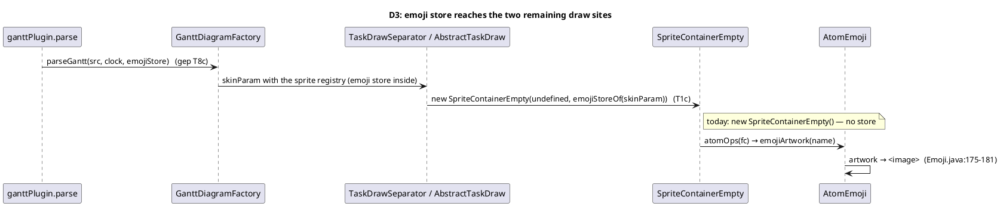

# Data flow — the three paths this drive changes

## 1. A transparent link path (D1, T1a)

```plantuml
@startuml
title D1: UPath draw with a transparent colour over the default back
participant "GanttArrow" as A
participant "UGraphicSvg (UParam)" as U
participant "DriverPathSvg" as D
participant "SvgGraphics" as S
A -> U : apply(HColors.transparent()).draw(UPath)
U -> D : draw(shape, param)
D -> D : paintsEqual(color, back)
note right of D
  Java: color.equals(back) is TRUE —
  both are HColors.none() (TRANSPARENT).
  Ours today: back is the string 'none',
  colour an HColorSimple → false.
  T1a: the seam equates the two.
end note
alt equal (jar, and ours after T1a)
  D -> S : setFillColor(color.toSvg); setStrokeColor(""); setStrokeWidth(0)
  S -> S : <path d=… fill="none"/>  (no style)
else not equal (ours today)
  D -> S : applyFillColor; applyStrokeColor; setStrokeWidth(1)
  S -> S : <path … style="stroke:none;" fill="none"/>
end
@enduml
```

## 2. Hidden footer under top chrome (D2, T1b/T2a)

```plantuml
@startuml
title D2: titled gantt with hide footbox — where 8 px is lost
participant "GanttDiagramMainBlock" as M
participant "gantt index.ts rawTextBlock" as R
participant "annotations/chrome.ts" as C
participant "TextBlockExporter.ts" as E
M -> R : calculateDimension = rows + footer(0)  (GanttLayout.java:103)
R -> C : fragment {height = dim, drawBodyAt, exportMargin}
C -> C : initial.height = preChromeHeight ?? height; ink = inkOfBody(body)
note right of C
  Jar stacks the title on
  original.calculateDimension
  (DiagramChromeFactory.java:363).
  Probe: ours is 8 px short only with
  title/header + hide footbox; caption
  and every single-feature case match.
  T1b pins the hop; T2a fixes it there.
end note
C -> E : chromed fragment
E -> E : exportTo → svg width/height
@enduml
```

## 3. Emoji in a separator name or note (D3, T1c)

```plantuml
@startuml
title D3: emoji store reaches the two remaining draw sites
participant "ganttPlugin.parse" as P
participant "GanttDiagramFactory" as F
participant "TaskDrawSeparator / AbstractTaskDraw" as T
participant "SpriteContainerEmpty" as S
participant "AtomEmoji" as A
P -> F : parseGantt(src, clock, emojiStore)   (gep T8c)
F -> T : skinParam with the sprite registry (emoji store inside)
T -> S : new SpriteContainerEmpty(undefined, emojiStoreOf(skinParam))   (T1c)
note right of S : today: new SpriteContainerEmpty() — no store
S -> A : atomOps(fc) → emojiArtwork(name)
A -> A : artwork → <image>  (Emoji.java:175-181)
@enduml
```
