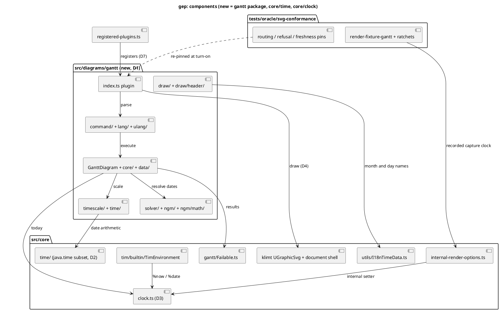

# Component map — what gep adds and touches

```plantuml
@startuml
title gep: components (new = gantt package, core/time, core/clock)
package "src/diagrams/gantt (new, D1)" {
  [command/ + lang/ + ulang/] as Cmd
  [GanttDiagram + core/ + data/] as Model
  [solver/ + ngm/ + ngm/math/] as Solve
  [timescale/ + time/] as Time
  [draw/ + draw/header/] as Draw
  [index.ts plugin] as Plugin
}
package "src/core" {
  [time/ (java.time subset, D2)] as JT
  [clock.ts (D3)] as Clock
  [utils/I18nTimeData.ts] as I18n
  [gantt/Failable.ts] as Fail
  [klimt UGraphicSvg + document shell] as Klimt
  [tim/builtin/TimEnvironment] as Tim
  [internal-render-options.ts] as IRO
}
[registered-plugins.ts] as Reg
package "tests/oracle/svg-conformance" {
  [render-fixture-gantt + ratchets] as Harness
  [routing / refusal / freshness pins] as Pins
}
Reg --> Plugin : registers (D7)
Plugin --> Cmd : parse
Cmd --> Model : execute
Model --> Solve : resolve dates
Model --> Time : scale
Time --> JT : date arithmetic
Model --> Clock : today
Tim --> Clock : %now / %date
IRO --> Clock : internal setter
Draw --> I18n : month and day names
Model --> Fail : results
Plugin --> Klimt : draw (D4)
Harness --> IRO : recorded capture clock
Pins ..> Plugin : re-pinned at turn-on
@enduml
```
