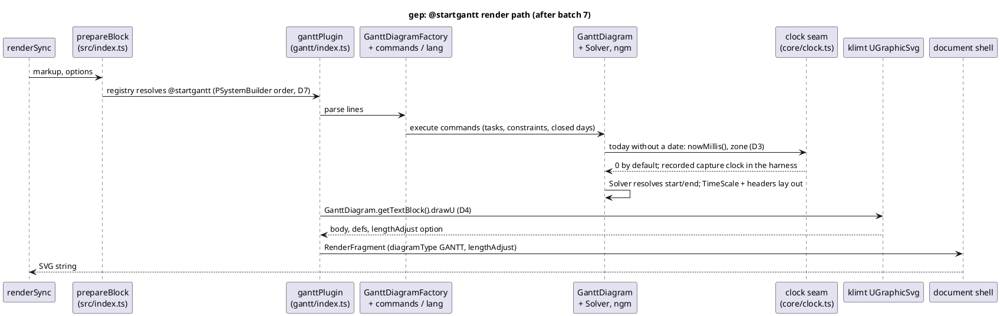
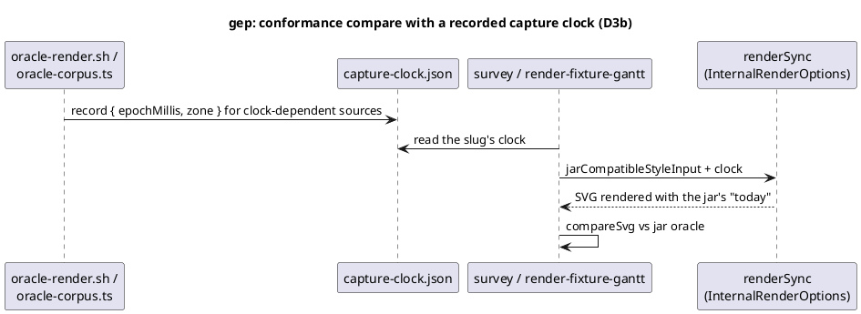

# Data flow — one `@startgantt` render, and the harness clock

```plantuml
@startuml
title gep: @startgantt render path (after batch 7)
participant "renderSync" as R
participant "prepareBlock\n(src/index.ts)" as P
participant "ganttPlugin\n(gantt/index.ts)" as G
participant "GanttDiagramFactory\n+ commands / lang" as F
participant "GanttDiagram\n+ Solver, ngm" as D
participant "clock seam\n(core/clock.ts)" as C
participant "klimt UGraphicSvg" as K
participant "document shell" as S
R -> P : markup, options
P -> G : registry resolves @startgantt (PSystemBuilder order, D7)
G -> F : parse lines
F -> D : execute commands (tasks, constraints, closed days)
D -> C : today without a date: nowMillis(), zone (D3)
C --> D : 0 by default; recorded capture clock in the harness
D -> D : Solver resolves start/end; TimeScale + headers lay out
G -> K : GanttDiagram.getTextBlock().drawU (D4)
K --> G : body, defs, lengthAdjust option
G -> S : RenderFragment (diagramType GANTT, lengthAdjust)
S --> R : SVG string
@enduml
```

```plantuml
@startuml
title gep: conformance compare with a recorded capture clock (D3b)
participant "oracle-render.sh /\noracle-corpus.ts" as O
participant "capture-clock.json" as J
participant "survey / render-fixture-gantt" as H
participant "renderSync\n(InternalRenderOptions)" as R
O -> J : record { epochMillis, zone } for clock-dependent sources
H -> J : read the slug's clock
H -> R : jarCompatibleStyleInput + clock
R --> H : SVG rendered with the jar's "today"
H -> H : compareSvg vs jar oracle
@enduml
```
