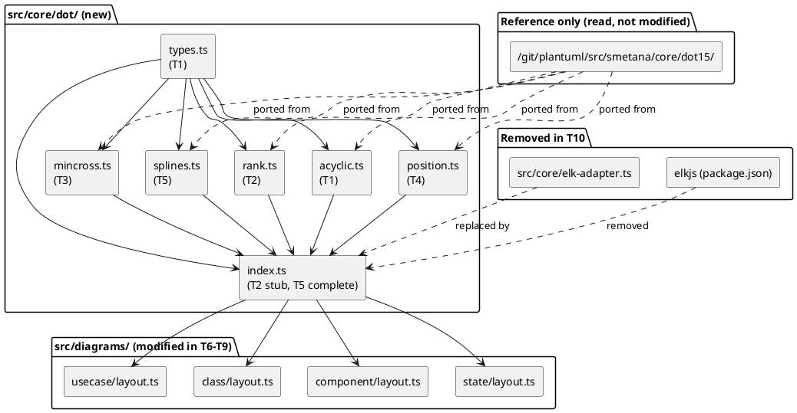

# Component Map

```plantuml
@startuml
skinparam componentStyle rectangle
skinparam shadowing false

package "src/core/dot/ (new)" {
  [types.ts\n(T1)] as types
  [acyclic.ts\n(T1)] as acyclic
  [rank.ts\n(T2)] as rank
  [mincross.ts\n(T3)] as mincross
  [position.ts\n(T4)] as position
  [splines.ts\n(T5)] as splines
  [index.ts\n(T2 stub, T5 complete)] as index
}

package "src/diagrams/ (modified in T6-T9)" {
  [usecase/layout.ts] as uc
  [class/layout.ts] as cls
  [component/layout.ts] as comp
  [state/layout.ts] as st
}

package "Removed in T10" {
  [src/core/elk-adapter.ts] as elk
  [elkjs (package.json)] as elkpkg
}

package "Reference only (read, not modified)" {
  [~/git/plantuml/src/smetana/core/dot15/] as ref
}

types --> acyclic
types --> rank
types --> mincross
types --> position
types --> splines
types --> index
acyclic --> index
rank --> index
mincross --> index
position --> index
splines --> index
index --> uc
index --> cls
index --> comp
index --> st
elk ..> index : replaced by
elkpkg ..> index : removed
ref ..> acyclic : ported from
ref ..> rank : ported from
ref ..> mincross : ported from
ref ..> position : ported from
ref ..> splines : ported from
@enduml
```
