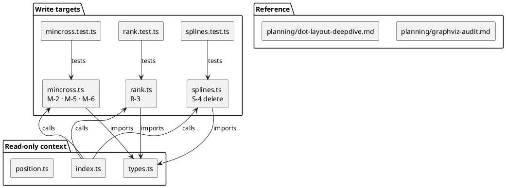

# Component Map — Files Touched

```plantuml
@startuml
skinparam componentStyle rectangle
skinparam shadowing false

package "Write targets" {
  [mincross.ts\nM-2 · M-5 · M-6] as MC
  [rank.ts\nR-3] as RK
  [splines.ts\nS-4 delete] as SP
  [mincross.test.ts] as TMC
  [rank.test.ts] as TRK
  [splines.test.ts] as TSP
}

package "Read-only context" {
  [types.ts] as TY
  [index.ts] as IX
  [position.ts] as PO
}

package "Reference" {
  [planning/graphviz-audit.md] as AU
  [planning/dot-layout-deepdive.md] as DD
}

MC --> TY : imports
RK --> TY : imports
SP --> TY : imports
IX --> MC : calls
IX --> RK : calls
IX --> SP : calls
TMC --> MC : tests
TRK --> RK : tests
TSP --> SP : tests
@enduml
```
