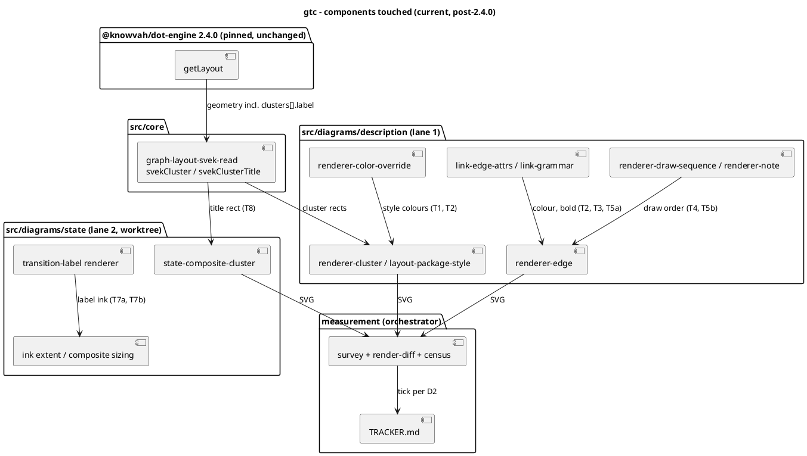

# Component map

Components this mission touches. dot-engine is pinned and unchanged (D1); every residual is in our post-layout drawing.

```plantuml
@startuml
title gtc - components touched (current, post-2.4.0)
package "@knowvah/dot-engine 2.4.0 (pinned, unchanged)" {
  [getLayout] as GL
}
package "src/core" {
  [graph-layout-svek-read\nsvekCluster / svekClusterTitle] as SR
}
package "src/diagrams/description (lane 1)" {
  [renderer-cluster / layout-package-style] as RC
  [renderer-color-override] as CO
  [link-edge-attrs / link-grammar] as LE
  [renderer-edge] as RE
  [renderer-draw-sequence / renderer-note] as DS
}
package "src/diagrams/state (lane 2, worktree)" {
  [state-composite-cluster] as SC
  [transition-label renderer] as TL
  [ink extent / composite sizing] as IE
}
package "measurement (orchestrator)" {
  [survey + render-diff + census] as M
  [TRACKER.md] as TR
}
GL --> SR : geometry incl. clusters[].label
SR --> RC : cluster rects
SR --> SC : title rect (T8)
LE --> RE : colour, bold (T2, T3, T5a)
CO --> RC : style colours (T1, T2)
DS --> RE : draw order (T4, T5b)
TL --> IE : label ink (T7a, T7b)
RC --> M : SVG
RE --> M : SVG
SC --> M : SVG
M --> TR : tick per D2
@enduml
```
