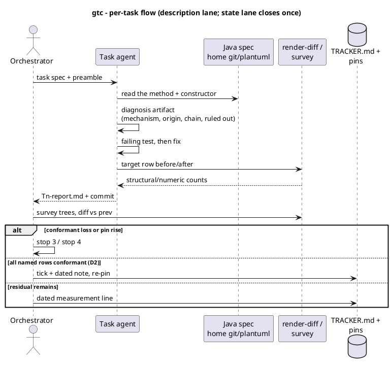

# Data flow

One task, from spec to tick. The description lane closes per task; the state lane closes once, after T8 (close-procedure B).

```plantuml
@startuml
title gtc - per-task flow (description lane; state lane closes once)
actor Orchestrator as O
participant "Task agent" as A
participant "Java spec\nhome git/plantuml" as J
participant "render-diff /\nsurvey" as R
database "TRACKER.md +\npins" as T
O -> A : task spec + preamble
A -> J : read the method + constructor
A -> A : diagnosis artifact\n(mechanism, origin, chain, ruled out)
A -> A : failing test, then fix
A -> R : target row before/after
R --> A : structural/numeric counts
A --> O : Tn-report.md + commit
O -> R : survey trees, diff vs prev
alt conformant loss or pin rise
  O -> O : stop 3 / stop 4
else all named rows conformant (D2)
  O -> T : tick + dated note, re-pin
else residual remains
  O -> T : dated measurement line
end
@enduml
```
