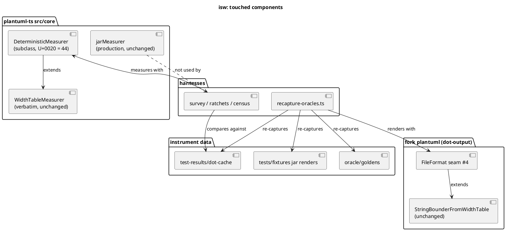

# Component map — what isw touches

```plantuml
@startuml
title isw: touched components
package "fork plantuml (dot-output)" {
  component "FileFormat seam #4" as Seam
  component "StringBounderFromWidthTable\n(unchanged)" as SB
}
package "plantuml-ts src/core" {
  component "WidthTableMeasurer\n(verbatim, unchanged)" as WT
  component "DeterministicMeasurer\n(subclass, U+0020 = 44)" as DM
  component "jarMeasurer\n(production, unchanged)" as JM
}
package "instrument data" {
  component "test-results/dot-cache" as Cache
  component "oracle/goldens" as Gold
  component "tests/fixtures jar renders" as Fix
}
package "harnesses" {
  component "survey / ratchets / census" as H
  component "recapture-oracles.ts" as RC
}
Seam --> SB : extends
DM --> WT : extends
RC --> Seam : renders with
RC --> Cache : re-captures
RC --> Gold : re-captures
RC --> Fix : re-captures
H --> DM : measures with
H --> Cache : compares against
JM ..> H : not used by
@enduml
```
