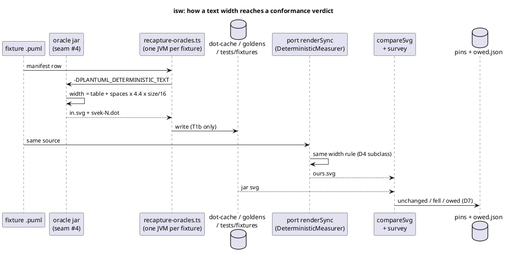

# Data flow — one instrument, two sides, changed together (D5)

```plantuml
@startuml
title isw: how a text width reaches a conformance verdict
participant "fixture .puml" as P
participant "oracle jar\n(seam #4)" as J
participant "recapture-oracles.ts\n(one JVM per fixture)" as R
database "dot-cache / goldens\n/ tests/fixtures" as C
participant "port renderSync\n(DeterministicMeasurer)" as O
participant "compareSvg\n+ survey" as V
database "pins + owed.json" as K

P -> R : manifest row
R -> J : -DPLANTUML_DETERMINISTIC_TEXT
J -> J : width = table + spaces x 4.4 x size/16
J --> R : in.svg + svek-N.dot
R -> C : write (T1b only)
P -> O : same source
O -> O : same width rule (D4 subclass)
O --> V : ours.svg
C --> V : jar svg
V -> K : unchanged / fell / owed (D7)
@enduml
```
