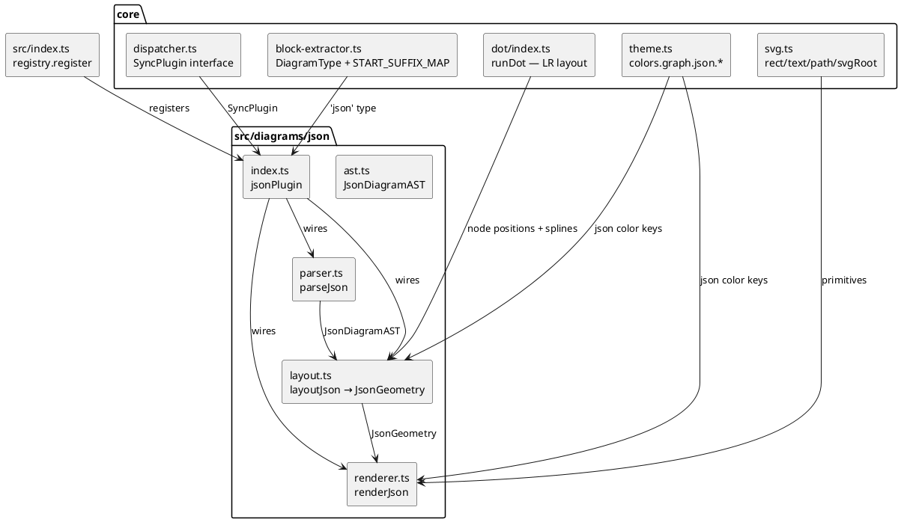

# Component Map

```plantuml
@startuml
skinparam componentStyle rectangle
skinparam shadowing false

package "core" {
  [block-extractor.ts\nDiagramType + START_SUFFIX_MAP] as BE
  [theme.ts\ncolors.graph.json.*] as TH
  [dot/index.ts\nrunDot — LR layout] as DOT
  [svg.ts\nrect/text/path/svgRoot] as SVG
  [dispatcher.ts\nSyncPlugin interface] as DISP
}

package "src/diagrams/json" {
  [ast.ts\nJsonDiagramAST] as AST
  [parser.ts\nparseJson] as PARSER
  [layout.ts\nlayoutJson → JsonGeometry] as LAYOUT
  [renderer.ts\nrenderJson] as RENDERER
  [index.ts\njsonPlugin] as PLUGIN
}

[src/index.ts\nregistry.register] as IDX

BE --> PLUGIN : 'json' type
TH --> LAYOUT : json color keys
TH --> RENDERER : json color keys
DOT --> LAYOUT : node positions + splines
SVG --> RENDERER : primitives
PARSER --> LAYOUT : JsonDiagramAST
LAYOUT --> RENDERER : JsonGeometry
PLUGIN --> PARSER : wires
PLUGIN --> LAYOUT : wires
PLUGIN --> RENDERER : wires
IDX --> PLUGIN : registers
DISP --> PLUGIN : SyncPlugin
@enduml
```
