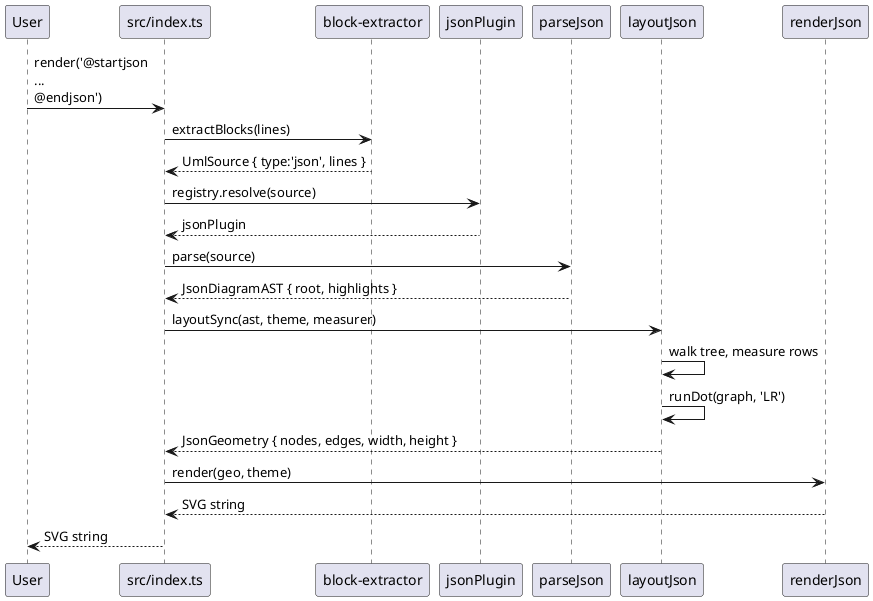

# Data Flow

```plantuml
@startuml
participant User
participant "src/index.ts" as index
participant "block-extractor" as BE
participant "jsonPlugin" as Plugin
participant "parseJson" as Parser
participant "layoutJson" as Layout
participant "renderJson" as Renderer
User -> index : render('@startjson\n...\n@endjson')
index -> BE : extractBlocks(lines)
BE --> index : UmlSource { type:'json', lines }
index -> Plugin : registry.resolve(source)
Plugin --> index : jsonPlugin
index -> Parser : parse(source)
Parser --> index : JsonDiagramAST { root, highlights }
index -> Layout : layoutSync(ast, theme, measurer)
Layout -> Layout : walk tree, measure rows
Layout -> Layout : runDot(graph, 'LR')
Layout --> index : JsonGeometry { nodes, edges, width, height }
index -> Renderer : render(geo, theme)
Renderer --> index : SVG string
index --> User : SVG string
@enduml
```
