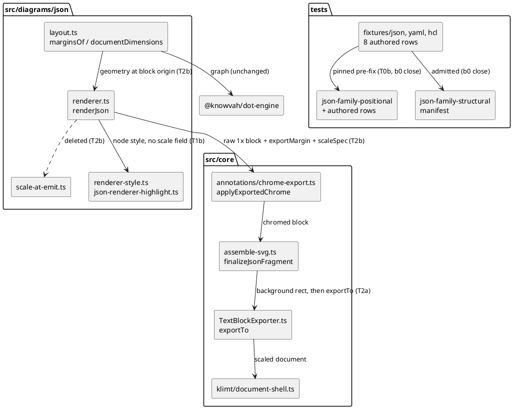

# Component map — what jff touches

Components the mission changes (bold notes) and the ones it reads only.

```plantuml
@startuml
skinparam componentStyle rectangle
package "src/diagrams/json" {
  [layout.ts\nmarginsOf / documentDimensions] as layout
  [renderer.ts\nrenderJson] as renderer
  [scale-at-emit.ts] as sae
  [renderer-style.ts\njson-renderer-highlight.ts] as style
}
package "src/core" {
  [annotations/chrome-export.ts\napplyExportedChrome] as chrome
  [assemble-svg.ts\nfinalizeJsonFragment] as finalize
  [TextBlockExporter.ts\nexportTo] as exporter
  [klimt/document-shell.ts] as shell
}
package "tests" {
  [fixtures/json, yaml, hcl\n8 authored rows] as fixtures
  [json-family-positional\n+ authored rows] as positional
  [json-family-structural\nmanifest] as structural
}
[@knowvah/dot-engine] as engine

layout --> engine : graph (unchanged)
layout --> renderer : geometry at block origin (T2b)
renderer --> chrome : raw 1x block + exportMargin + scaleSpec (T2b)
renderer ..> sae : deleted (T2b)
renderer --> style : node style, no scale field (T1b)
chrome --> finalize : chromed block
finalize --> exporter : background rect, then exportTo (T2a)
exporter --> shell : scaled document
fixtures --> positional : pinned pre-fix (T0b, b0 close)
fixtures --> structural : admitted (b0 close)
@enduml
```
