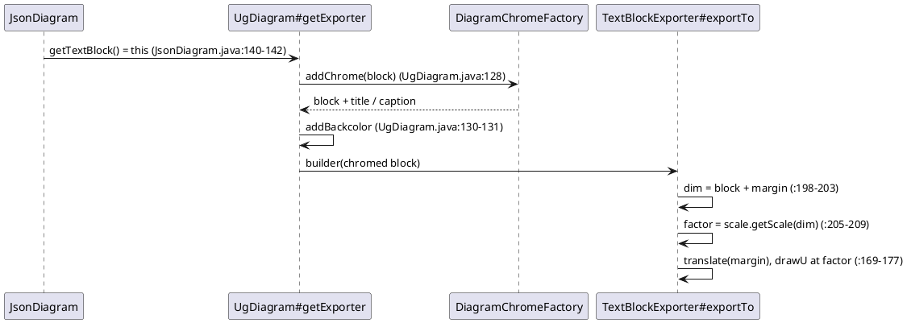
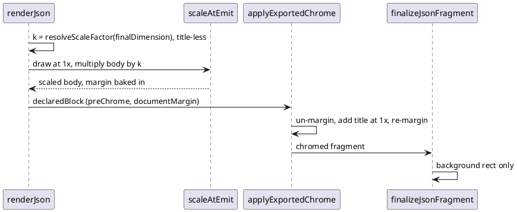
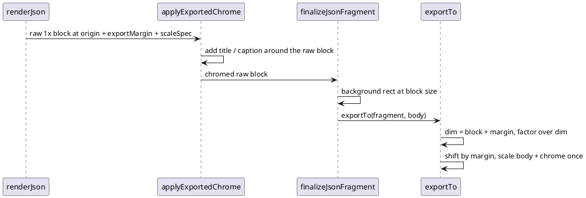

# Data flow — `scale` × title, before and after

## Upstream (the spec)

```plantuml
@startuml
participant "JsonDiagram" as jd
participant "UgDiagram#getExporter" as ug
participant "DiagramChromeFactory" as dcf
participant "TextBlockExporter#exportTo" as tbe
jd -> ug : getTextBlock() = this (JsonDiagram.java:140-142)
ug -> dcf : addChrome(block) (UgDiagram.java:128)
dcf --> ug : block + title / caption
ug -> ug : addBackcolor (UgDiagram.java:130-131)
ug -> tbe : builder(chromed block)
tbe -> tbe : dim = block + margin (:198-203)
tbe -> tbe : factor = scale.getScale(dim) (:205-209)
tbe -> tbe : translate(margin), drawU at factor (:169-177)
@enduml
```

## Ours today (the defect)

```plantuml
@startuml
participant "renderJson" as r
participant "scaleAtEmit" as s
participant "applyExportedChrome" as c
participant "finalizeJsonFragment" as f
r -> r : k = resolveScaleFactor(finalDimension), title-less
r -> s : draw at 1x, multiply body by k
s --> r : scaled body, margin baked in
r -> c : declaredBlock (preChrome, documentMargin)
c -> c : un-margin, add title at 1x, re-margin
c -> f : chromed fragment
f -> f : background rect only
@enduml
```

## After batch 2

```plantuml
@startuml
participant "renderJson" as r
participant "applyExportedChrome" as c
participant "finalizeJsonFragment" as f
participant "exportTo" as e
r -> c : raw 1x block at origin + exportMargin + scaleSpec
c -> c : add title / caption around the raw block
c -> f : chromed raw block
f -> f : background rect at block size
f -> e : exportTo(fragment, body)
e -> e : dim = block + margin, factor over dim
e -> e : shift by margin, scale body + chrome once
@enduml
```
