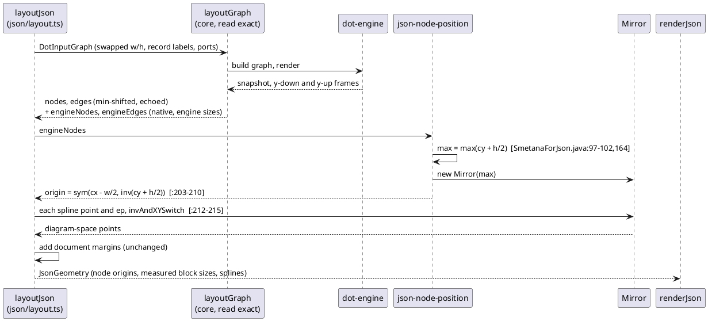

# Data flow — one json diagram, after T3a

How a node's origin and an edge's points reach the SVG once json reads the
engine's native frame (decisions D1, M1, M2).

```plantuml
@startuml
participant "layoutJson\n(json/layout.ts)" as lj
participant "layoutGraph\n(core, read exact)" as lg
participant "dot-engine" as de
participant "json-node-position" as pos
participant "Mirror" as mir
participant "renderJson" as rj

lj -> lg : DotInputGraph (swapped w/h, record labels, ports)
lg -> de : build graph, render
de --> lg : snapshot, y-down and y-up frames
lg --> lj : nodes, edges (min-shifted, echoed)\n+ engineNodes, engineEdges (native, engine sizes)
lj -> pos : engineNodes
pos -> pos : max = max(cy + h/2)  [SmetanaForJson.java:97-102,164]
pos -> mir : new Mirror(max)
pos --> lj : origin = sym(cx - w/2, inv(cy + h/2))  [:203-210]
lj -> mir : each spline point and ep, invAndXYSwitch  [:212-215]
mir --> lj : diagram-space points
lj -> lj : add document margins (unchanged)
lj --> rj : JsonGeometry (node origins, measured block sizes, splines)
@enduml
```
