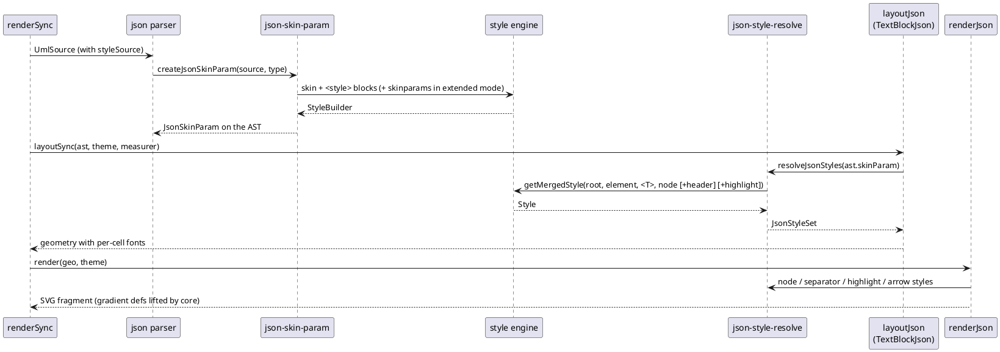

# Data flow — one `@startjson` render after the mission

```plantuml
@startuml
participant "renderSync" as R
participant "json parser" as P
participant "json-skin-param" as S
participant "style engine" as E
participant "json-style-resolve" as V
participant "layoutJson\n(TextBlockJson)" as L
participant "renderJson" as N
R -> P : UmlSource (with styleSource)
P -> S : createJsonSkinParam(source, type)
S -> E : skin + <style> blocks (+ skinparams in extended mode)
E --> S : StyleBuilder
S --> P : JsonSkinParam on the AST
R -> L : layoutSync(ast, theme, measurer)
L -> V : resolveJsonStyles(ast.skinParam)
V -> E : getMergedStyle(root, element, <T>, node [+header] [+highlight])
E --> V : Style
V --> L : JsonStyleSet
L --> R : geometry with per-cell fonts
R -> N : render(geo, theme)
N -> V : node / separator / highlight / arrow styles
N --> R : SVG fragment (gradient defs lifted by core)
@enduml
```
