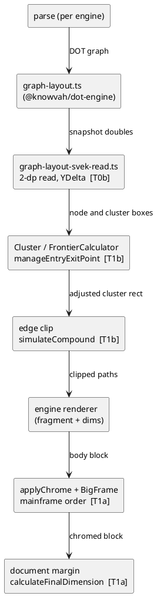

# Data flow: where each lgm task sits in the pipeline

```plantuml
@startuml
skinparam componentStyle rectangle
rectangle "parse (per engine)" as P
rectangle "graph-layout.ts\n(@knowvah/dot-engine)" as L
rectangle "graph-layout-svek-read.ts\n2-dp read, YDelta  [T0b]" as R
rectangle "Cluster / FrontierCalculator\nmanageEntryExitPoint  [T1b]" as C
rectangle "edge clip\nsimulateCompound  [T1b]" as E
rectangle "engine renderer\n(fragment + dims)" as F
rectangle "applyChrome + BigFrame\nmainframe order  [T1a]" as M
rectangle "document margin\ncalculateFinalDimension  [T1a]" as D
P --> L : DOT graph
L --> R : snapshot doubles
R --> C : node and cluster boxes
C --> E : adjusted cluster rect
E --> F : clipped paths
F --> M : body block
M --> D : chromed block
@enduml
```
