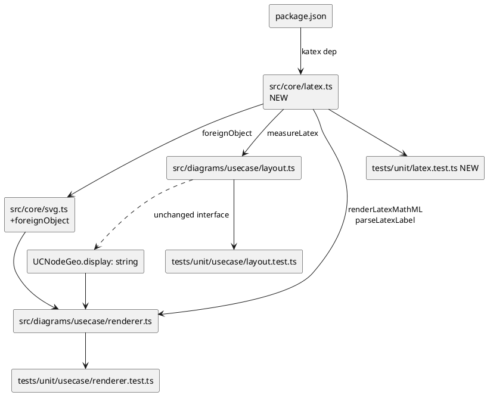

```plantuml
@startuml
skinparam componentStyle rectangle
skinparam shadowing false

[package.json] as PKG
[src/core/latex.ts\nNEW] as LATEX
[src/core/svg.ts\n+foreignObject] as SVG
[src/diagrams/usecase/layout.ts] as LAYOUT
[src/diagrams/usecase/renderer.ts] as RENDERER
[UCNodeGeo.display: string] as GEO
[tests/unit/latex.test.ts NEW] as T1_TEST
[tests/unit/usecase/layout.test.ts] as T2_TEST
[tests/unit/usecase/renderer.test.ts] as T3_TEST

PKG --> LATEX : katex dep
LATEX --> SVG : foreignObject
LATEX --> LAYOUT : measureLatex
LATEX --> RENDERER : renderLatexMathML\nparseLatexLabel
SVG --> RENDERER
LAYOUT ..> GEO : unchanged interface
GEO --> RENDERER
LATEX --> T1_TEST
LAYOUT --> T2_TEST
RENDERER --> T3_TEST
@enduml
```
