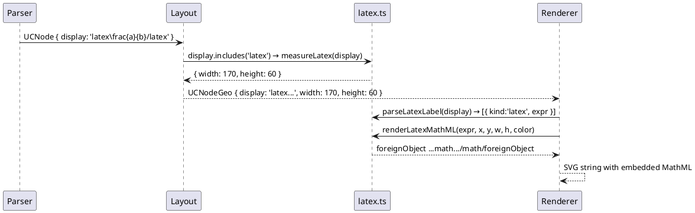

```plantuml
@startuml
participant "Parser" as P
participant "Layout" as L
participant "latex.ts" as LA
participant "Renderer" as R
P -> L : UCNode { display: 'latex\\frac{a}{b}/latex' }
L -> LA : display.includes('latex') → measureLatex(display)
LA --> L : { width: 170, height: 60 }
L --> R : UCNodeGeo { display: 'latex...', width: 170, height: 60 }
R -> LA : parseLatexLabel(display) → [{ kind:'latex', expr }]
R -> LA : renderLatexMathML(expr, x, y, w, h, color)
LA --> R : foreignObject ...math.../math/foreignObject
R --> R : SVG string with embedded MathML
@enduml
```
