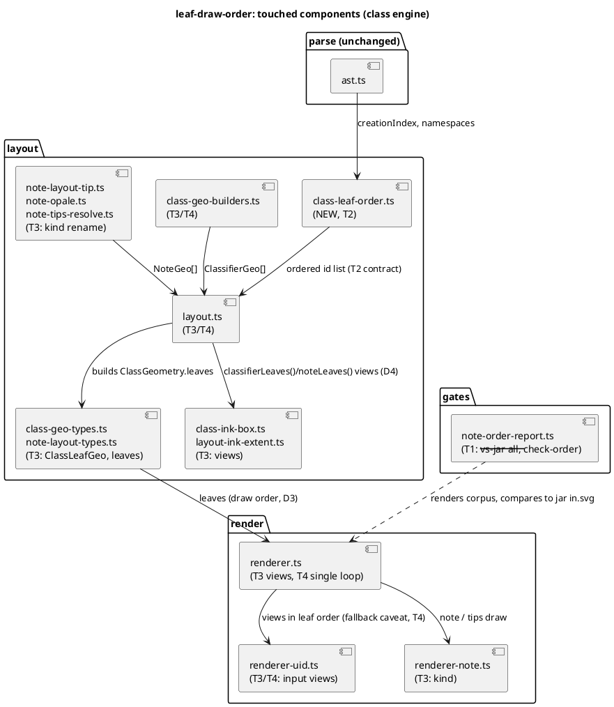

# Component map — what this mission touches

```plantuml
@startuml
title leaf-draw-order: touched components (class engine)

package "parse (unchanged)" {
  [ast.ts] as AST
}
package "layout" {
  [class-leaf-order.ts\n(NEW, T2)] as ORD
  [layout.ts\n(T3/T4)] as LAY
  [class-geo-builders.ts\n(T3/T4)] as GB
  [note-layout-tip.ts\nnote-opale.ts\nnote-tips-resolve.ts\n(T3: kind rename)] as NL
  [class-geo-types.ts\nnote-layout-types.ts\n(T3: ClassLeafGeo, leaves)] as TYPES
  [class-ink-box.ts\nlayout-ink-extent.ts\n(T3: views)] as INK
}
package "render" {
  [renderer.ts\n(T3 views, T4 single loop)] as REN
  [renderer-uid.ts\n(T3/T4: input views)] as UID
  [renderer-note.ts\n(T3: kind)] as RN
}
package "gates" {
  [note-order-report.ts\n(T1: --vs-jar all, --check-order)] as GATE
}

AST --> ORD : creationIndex, namespaces
ORD --> LAY : ordered id list (T2 contract)
GB --> LAY : ClassifierGeo[]
NL --> LAY : NoteGeo[]
LAY --> TYPES : builds ClassGeometry.leaves
LAY --> INK : classifierLeaves()/noteLeaves() views (D4)
TYPES --> REN : leaves (draw order, D3)
REN --> UID : views in leaf order (fallback caveat, T4)
REN --> RN : note / tips draw
GATE ..> REN : renders corpus, compares to jar in.svg
@enduml
```

Not touched: `class-dot-graph.ts` (DOT build), the state engine, layout
arithmetic, uid numbering rules, `oracle/goldens`.
