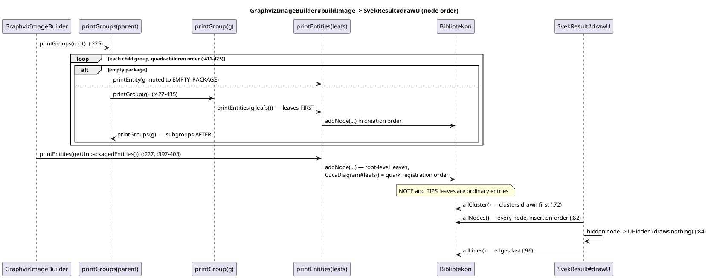
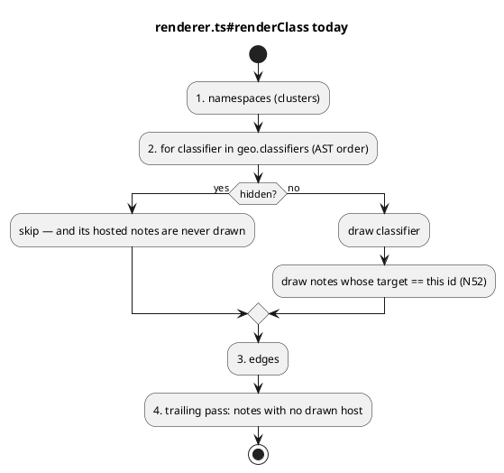
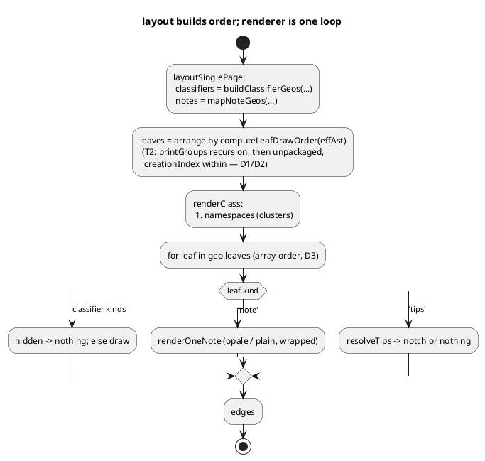

# Data flow — jar's node order vs the port, before and after

## Jar: how `bibliotekon` gets its order, then draws it

```plantuml
@startuml
title GraphvizImageBuilder#buildImage -> SvekResult#drawU (node order)

participant "GraphvizImageBuilder" as GIB
participant "printGroups(parent)" as PG
participant "printGroup(g)" as G
participant "printEntities(leafs)" as PE
participant "Bibliotekon" as B
participant "SvekResult#drawU" as D

GIB -> PG : printGroups(root)  (:225)
loop each child group, quark-children order (:411-425)
  alt empty package
    PG -> PE : printEntity(g muted to EMPTY_PACKAGE)
  else
    PG -> G : printGroup(g)  (:427-435)
    G -> PE : printEntities(g.leafs())  — leaves FIRST
    PE -> B : addNode(...) in creation order
    G -> PG : printGroups(g)  — subgroups AFTER
  end
end
GIB -> PE : printEntities(getUnpackagedEntities())  (:227, :397-403)
PE -> B : addNode(...) — root-level leaves,\nCucaDiagram#leafs() = quark registration order
note over B : NOTE and TIPS leaves are ordinary entries
D -> B : allCluster() — clusters drawn first (:72)
D -> B : allNodes() — every node, insertion order (:82)
D -> D : hidden node -> UHidden (draws nothing) (:84)
D -> B : allLines() — edges last (:96)
@enduml
```

## Port, before this mission (N52 host-interleave)

```plantuml
@startuml
title renderer.ts#renderClass today

start
:1. namespaces (clusters);
:2. for classifier in geo.classifiers (AST order);
if (hidden?) then (yes)
  :skip — and its hosted notes are never drawn;
else (no)
  :draw classifier;
  :draw notes whose target == this id (N52);
endif
:3. edges;
:4. trailing pass: notes with no drawn host;
stop
@enduml
```

## Port, after T4

```plantuml
@startuml
title layout builds order; renderer is one loop

start
:layoutSinglePage:
 classifiers = buildClassifierGeos(...)
 notes = mapNoteGeos(...);
:leaves = arrange by computeLeafDrawOrder(effAst)
 (T2: printGroups recursion, then unpackaged,
  creationIndex within — D1/D2);
:renderClass:
 1. namespaces (clusters);
:for leaf in geo.leaves (array order, D3);
switch (leaf.kind)
case (classifier kinds)
  :hidden -> nothing; else draw;
case ('note')
  :renderOneNote (opale / plain, wrapped);
case ('tips')
  :resolveTips -> notch or nothing;
endswitch
:edges;
stop
@enduml
```
