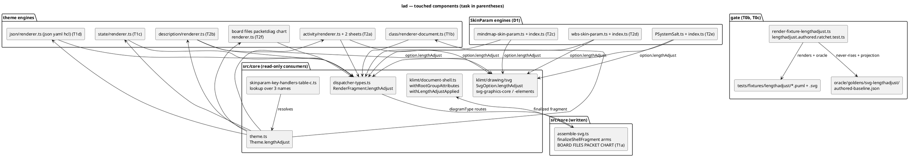

# lad — component map

Which modules each batch touches, and how they relate. Core modules that only
consume the field are read-only in this drive.

```plantuml
@startuml
title lad — touched components (task in parentheses)
skinparam componentStyle rectangle

package "src/core (read-only consumers)" {
  [skinparam-key-handlers-table-c.ts\nlookup over 3 names] as KH
  [theme.ts\nTheme.lengthAdjust] as TH
  [dispatcher-types.ts\nRenderFragment.lengthAdjust] as RF
  [klimt/document-shell.ts\nwithRootGroupAttributes\nwithLengthAdjustApplied] as SH
  [klimt/drawing/svg\nSvgOption.lengthAdjust\nsvg-graphics-core / -elements] as UG
}

package "src/core (written)" {
  [assemble-svg.ts\nfinalizeShellFragment arms\nBOARD FILES PACKET CHART (T1a)] as AS
}

package "theme engines" {
  [class/renderer-document.ts (T1b)] as CL
  [state/renderer.ts (T1c)] as ST
  [json/renderer.ts (json yaml hcl) (T1d)] as JS
  [activity/renderer.ts + 2 sheets (T2a)] as AC
  [description/renderer.ts (T2b)] as DE
  [board files packetdiag chart\nrenderer.ts (T2f)] as GE
}

package "SkinParam engines (D1)" {
  [mindmap-skin-param.ts + index.ts (T2c)] as MM
  [wbs-skin-param.ts + index.ts (T2d)] as WB
  [PSystemSalt.ts + index.ts (T2e)] as SA
}

package "gate (T0b, T0c)" {
  [tests/fixtures/lengthadjust/*.puml + .svg] as FX
  [render-fixture-lengthadjust.ts\nlengthadjust.authored.ratchet.test.ts] as GT
  [oracle/goldens/svg-lengthadjust/\nauthored-baseline.json] as BL
}

KH --> TH : resolves
TH --> CL
TH --> ST
TH --> JS
TH --> AC
TH --> DE
TH --> GE
MM --> UG : option.lengthAdjust
WB --> UG : option.lengthAdjust
SA --> UG : option.lengthAdjust
AC --> UG : option.lengthAdjust
DE --> UG : option.lengthAdjust
CL --> RF
ST --> RF
JS --> RF
AC --> RF
DE --> RF
GE --> RF
MM --> RF
WB --> RF
SA --> RF
RF --> AS : diagramType routes
AS --> SH : finalized fragment
GT --> FX : renders + oracle
GT --> BL : never-rises + projection
@enduml
```
