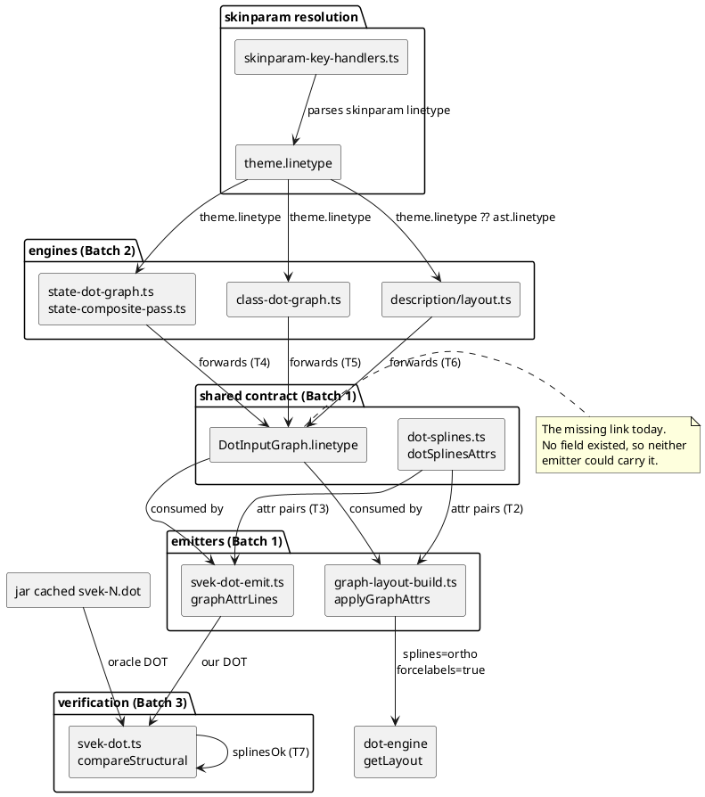

# Component map — what this mission touches

Component diagram: the question is *which deployable/logical parts talk to
which*, and where the missing attribute enters the chain.

```plantuml
@startuml
skinparam componentStyle rectangle

package "skinparam resolution" {
  [skinparam-key-handlers.ts] as KEYS
  [theme.linetype] as THEME
}

package "engines (Batch 2)" {
  [state-dot-graph.ts\nstate-composite-pass.ts] as STATE
  [class-dot-graph.ts] as CLASS
  [description/layout.ts] as DESC
}

package "shared contract (Batch 1)" {
  [DotInputGraph.linetype] as INPUT
  [dot-splines.ts\ndotSplinesAttrs] as HELPER
}

package "emitters (Batch 1)" {
  [graph-layout-build.ts\napplyGraphAttrs] as LAYOUT
  [svek-dot-emit.ts\ngraphAttrLines] as EMIT
}

package "verification (Batch 3)" {
  [svek-dot.ts\ncompareStructural] as PARITY
}

[dot-engine\ngetLayout] as ENGINE
[jar cached svek-N.dot] as JAR

KEYS --> THEME : parses skinparam linetype
THEME --> STATE : theme.linetype
THEME --> CLASS : theme.linetype
THEME --> DESC : theme.linetype ?? ast.linetype

STATE --> INPUT : forwards (T4)
CLASS --> INPUT : forwards (T5)
DESC --> INPUT : forwards (T6)

INPUT --> LAYOUT : consumed by
INPUT --> EMIT : consumed by
HELPER --> LAYOUT : attr pairs (T2)
HELPER --> EMIT : attr pairs (T3)

LAYOUT --> ENGINE : splines=ortho\nforcelabels=true
EMIT --> PARITY : our DOT
JAR --> PARITY : oracle DOT
PARITY --> PARITY : splinesOk (T7)

note right of INPUT
  The missing link today.
  No field existed, so neither
  emitter could carry it.
end note
@enduml
```
